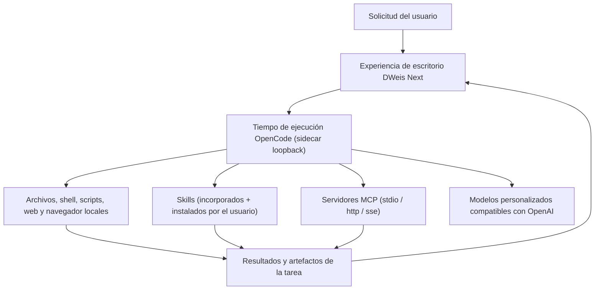

<div align="center">

**English** · [简体中文](README.zh-CN.md) · [日本語](README.ja.md) · [Español](README.es.md) · [한국어](README.ko.md)


# DWeis Next

**Una base de código abierta para construir agentes de IA de escritorio sobre OpenCode.**

Ejecuta, bifurca y publica un producto Agent de escritorio funcional, no una demo de interfaz de chat.
DWeis Next combina un tiempo de ejecución de OpenCode gestionado, herramientas locales, Skills,
servidores MCP, modelos personalizados, memoria persistente y una interfaz Electron multiplataforma
bien cuidada.

[Sitio web](https://dweis.ai/) · [Guía de desarrollo](docs/development.md) ·
[Arquitectura](docs/architecture.md)

[](LICENSE)


</div>

<p align="center">
  
</p>

<p align="center"><em>De una solicitud de chat a un artefacto interactivo reutilizable, en un solo espacio de trabajo.</em></p>

DWeis Next es desarrollado por [DWeis](https://dweis.ai/) para quienes quieren publicar Agents
de escritorio útiles sin tener que reconstruir la infraestructura de producto alrededor del bucle del
Agent. Bifúrcalo, reemplaza el modelo, los prompts, las herramientas, los Skills, la marca y la
distribución, y lanza un Agent para tu propio producto o flujo de trabajo.

También puedes usar DWeis Next tal cual: ejecútalo en local con tu propio modelo compatible con OpenAI
o inicia sesión para usar los modelos alojados de DWeis, un runtime OpenConnector opcional, autorización OAuth
y espacios de trabajo en equipo.

## Por qué abrimos el código de DWeis Next

Una demo convincente de Agent puede empezar con un modelo y un cuadro de chat. Un Agent de escritorio
en el que la gente pueda confiar necesita mucho más: gestión del ciclo de vida del tiempo de ejecución,
eventos en streaming, controles de acceso local, credenciales seguras de modelos, sesiones y proyectos,
actividad de herramientas, archivos generados, recuperación, empaquetado y una UI que haga comprensible
el trabajo autónomo.

DWeis Next abre toda la base de escritorio para que puedas:

- usar OpenCode como tiempo de ejecución de Agents más allá del desarrollo de software;
- crear herramientas, Skills, servidores MCP, prompts y flujos de trabajo específicos de tu dominio;
- combinar el trabajo local del equipo con acciones autenticadas en SaaS;
- distribuir un producto de escritorio con marca, en lugar de un prototipo sólo para desarrolladores;
- elegir cuánta infraestructura quieres operar tú mismo.

## Créditos

DWeis Next es un fork de [Wanta](https://github.com/oomol-lab/wanta), el proyecto original de
Agent de escritorio. La integración del tiempo de ejecución OpenCode, la arquitectura de la
aplicación Electron y el diseño general del producto se originan en ese proyecto.

Agradecemos a las personas contribuidoras de Wanta y al equipo que construyó la base sobre la que
se apoya este trabajo. DWeis Next sigue publicándose bajo la licencia Apache-2.0 y devuelve sus
cambios a la comunidad de código abierto.

## Qué hay en el repositorio

DWeis Next es hoy un Agent de trabajo general, pero la arquitectura está pensada para adaptarse.
Puede convertirse en un Agent de operaciones, de investigación, de soporte, de comercio electrónico,
de conocimiento empresarial, una herramienta interna u otro producto vertical de escritorio.

### Agent y tiempo de ejecución

- **Tiempo de ejecución OpenCode** gestionado como un sidecar local aislado, conducido por HTTP y SSE
  en loopback.
- **Chat en streaming** con actividad de herramientas, aprobaciones, prompts de preguntas
  estructuradas y adjuntos.
- **Modos de Agent** — Build y Plan, más las personas **Work/Code** para tareas cotidianas frente a
  proyectos de programación.
- **Niveles de razonamiento** — selección por modelo entre bajo / medio / alto / máximo.
- **Permisos locales** — las acciones de alto riesgo pasan por un flujo de aprobación explícito antes
  de ejecutarse.

### Modelos

- **Modelos personalizados compatibles con OpenAI** — cualquier provider, configurado por modelo y
  por provider.
- **Modelos alojados de DWeis** al iniciar sesión.
- **Credenciales por modelo** cifradas con Electron `safeStorage`; nunca se devuelven al renderer.
- **Selección de modelo del subagent** para los subagents `general` y `explore`.

### Herramientas, Skills y MCP

- **Herramientas locales** — archivos, shell, scripts, búsqueda, web, y generación de imagen/vídeo vía
  APIs compatibles con OpenAI.
- **Skills** — un directorio de Skills gestionado, con estados instalado/habilitado/deshabilitado,
  recarga por watcher y Skills de ofimática incluidos (PPT, DOCX, XLS, PDF).
- **Servidores MCP** — añade, edita y activa servidores Model Context Protocol (transportes stdio /
  http / sse) con vista de formulario o de JSON crudo.
- **Control de navegador integrado** — inicia sesión y opera sitios web conectados desde la barra
  lateral del chat.

### Artefactos y memoria

- **Panel de artefactos** — los archivos generados quedan asociados a la tarea, con vista previa de
  imágenes, PDF, documentos Word, hojas de cálculo (libros interactivos Univer) y presentaciones
  PowerPoint.
- **Memoria persistente** — un prompt de sistema a nivel de Agent y una memoria personal a nivel
  de usuario, ambos en disco, editables en Configuración, con revisión automática opcional.

### Estructura del proyecto

- **Segmentos Work y Code en la barra lateral** — listas de sesión separadas para trabajo cotidiano
  y proyectos de programación.
- **Sesiones, proyectos y vista de archivados** — cada conversación es una sesión, cada carpeta es
  un proyecto.
- **Tasks y Automation** — trabajos del Agent recurrentes y de una sola ejecución.
- **Base de conocimiento** — biblioteca personal de referencia buscable.

### Configuración y uso

- **Página de Configuración** con barra lateral de altura completa — gestión de modelos, configuración
  de herramientas, MCP, Skills, memoria, estadísticas de uso y canal de actualización.
- **Estadísticas de uso** — totales de tokens, tasa de acierto de caché, y desglose por modelo.

### Empaquetado y distribución

- **Empaquetado Electron multiplataforma** para macOS, Windows y Linux.
- **Instaladores firmados** con un canal estable de actualización automática.
- **Licencia Apache-2.0** para todo el repositorio.

## Ejecutar desde el código fuente

Requisitos: Node.js 22.22.2 o superior y pnpm a través de Corepack.

```bash
git clone https://github.com/3d-jq/DWeis-Next.git
cd DWeis-Next
corepack pnpm install
corepack pnpm run dev
```

Ese es el camino corto para probar el repositorio. La configuración del entorno, los comandos de
pruebas, la verificación del tiempo de ejecución, el empaquetado, la firma y los flujos de
publicación están en la [Guía de desarrollo](docs/development.md).

La pila es Electron 42, Vite 8, React 19, Tailwind CSS 4, OpenCode, TypeScript, Vitest, oxlint y
oxfmt.

> ### Agent Engine: OpenCode

DWeis Next inicia el binario fijado `opencode-ai@1.17.13` como un sidecar `opencode serve` solo de
loopback y lo controla mediante `@opencode-ai/sdk@1.17.13`. Los paquetes de OpenCode tienen licencia
MIT y se reconocen en [THIRD_PARTY_NOTICES.md](THIRD_PARTY_NOTICES.md). DWeis Next fija el tiempo de
ejecución, el SDK y los plugins exactamente a la misma versión porque sus APIs no se consideran
estables.

## Construye tu propio Agent

DWeis Next usa OpenCode como tiempo de ejecución local fijado y lo personaliza sin mantener un fork
del código fuente de OpenCode. El proceso principal de escritorio controla el sidecar por HTTP y SSE;
DWeis Next aporta el contrato del Agent, los modelos, los permisos, las herramientas, los Skills, el
MCP, las sesiones, la UI de producto y la integración de escritorio.

Los puntos de extensión más importantes son:

| Área                                       | Empieza por                                                          |
| ------------------------------------------ | -------------------------------------------------------------------- |
| Identidad del Agent y contrato operativo   | [`electron/agent/system-prompt.ts`](electron/agent/system-prompt.ts) |
| Modos, modelos, herramientas y permisos    | [`electron/agent/config.ts`](electron/agent/config.ts)               |
| Fuentes de herramientas, Skills y MCP      | [`electron/agent/tool-sources.ts`](electron/agent/tool-sources.ts)   |
| Soporte de modelos incorporados y propios  | [`electron/models/`](electron/models/)                               |
| Experiencia de chat, artefactos, navegador | [`src/routes/Chat/`](src/routes/Chat/)                               |
| Gestión de Skills                          | [`src/routes/Skills/`](src/routes/Skills/)                           |
| Toda la configuración del producto         | [`src/routes/Settings/`](src/routes/Settings/)                       |
| Identidad de la aplicación                 | [`electron/branding.ts`](electron/branding.ts)                       |

La capacidad del Agent es un único contrato de producto expresado en tres lugares: herramientas
habilitadas, reglas de permiso y prompt de sistema. Cámbialos juntos para que el comportamiento del
tiempo de ejecución, la seguridad y las expectativas de UI se mantengan alineadas. Lee la
[Guía de arquitectura](docs/architecture.md) y las
[Convenciones de código](docs/conventions.md) antes de cambiar estos límites.

## Cómo funciona



DWeis Next evita registrar cientos de herramientas específicas de provider en el contexto del modelo.
Las herramientas personalizadas, los Skills y los servidores MCP son cada uno un contrato pequeño y
explícito — los fallos de autorización se devuelven como estados estructurados del producto, no como
texto libre del modelo.

### OpenCode, el runtime OpenConnector y DWeis

- **OpenCode** es el tiempo de ejecución local del Agent. DWeis Next gestiona su ciclo de vida y
  aporta la configuración, los permisos, los prompts, las herramientas personalizadas y los Skills.
- **OpenConnector** es un modo de runtime Link opcional: un endpoint configurado por el usuario
  (`baseUrl` + `consoleUrl` + opcional `runtimeToken`) que permite a DWeis Next consumir acciones
  de una instancia de OpenConnector cuando hay una disponible.
- **DWeis** proporciona la capa alojada opcional para inicio de sesión, modelos gestionados,
  credenciales de Connector, OAuth, equipos, Skills, uso y facturación.

El núcleo Local BYOK no requiere una cuenta de DWeis. Iniciar sesión habilita la capa de conectores
alojados y de equipo, pero no es necesario para inspeccionar, bifurcar o desarrollar la aplicación
de escritorio.

Para el proceso completo, límites de confianza, IPC, streaming, autenticación y diseño de
almacenamiento, lee la [Guía de arquitectura](docs/architecture.md).

## Seguridad y fronteras de datos

- OpenCode escucha sólo en loopback y usa una contraseña aleatoria por proceso.
- Los tokens de sesión de DWeis y las API keys de modelos personalizados tienen almacenamiento y
  ciclo de vida separados.
- Las claves de modelos personalizados se cifran con Electron `safeStorage` y nunca vuelven al
  renderer.
- Las operaciones locales de alto riesgo se conectan a la UI de aprobación explícita de DWeis Next.
- Las sesiones locales no se suben silenciosamente a un espacio de equipo de DWeis.

Consulta [SECURITY.md](SECURITY.md) para la notificación privada de vulnerabilidades y la
[Guía de arquitectura](docs/architecture.md) para las fronteras de confianza completas.

## Mapa del proyecto

| Ruta                                       | Propósito                                                                           |
| ------------------------------------------ | ----------------------------------------------------------------------------------- |
| [`electron/`](electron/)                   | Proceso principal, preload, tiempo de ejecución del Agent y servicios de escritorio |
| [`src/`](src/)                             | Renderer de React, rutas, hooks y componentes de UI                                 |
| [`scripts/`](scripts/)                     | Soporte de desarrollo, preparación de binarios, empaquetado y publicación           |
| [`resources/`](resources/)                 | Marca y recursos empaquetados con la aplicación                                     |
| [`docs/`](docs/)                           | Producto, arquitectura, desarrollo, convenciones y registros de decisión            |
| [`.github/workflows/`](.github/workflows/) | Automatización de pull requests y publicación                                       |

## Documentación

- [Arquitectura](docs/architecture.md) — procesos, tiempo de ejecución del Agent, IPC, streaming,
  autenticación y flujo de datos
- [Guía de desarrollo](docs/development.md) — instalar, ejecutar, probar, empaquetar, firmar y publicar
- [Navegador integrado](docs/integrated-browser.md) — control de sitios web conectados desde el chat
- [Convenciones de código](docs/conventions.md) — reglas de implementación y fronteras de seguridad
- [Decisiones técnicas clave](docs/key-decisions.md) — por qué la arquitectura tiene esta forma
- [Resumen del proyecto](docs/project-overview.md) — alcance del producto y relaciones del ecosistema
- [Guía de contribución](CONTRIBUTING.md) — ramas, pull requests, verificación y reglas de contribución
- [Política de seguridad](SECURITY.md) — notificación privada de vulnerabilidades
- [Política de marcas](TRADEMARKS.md) y [Avisos de terceros](THIRD_PARTY_NOTICES.md)

## Contribuir

Las incidencias y los pull requests son bienvenidos. Antes de hacer un cambio sustancial de
comportamiento o UI, abre una incidencia para acordar la dirección y el alcance del producto. Lee
[CONTRIBUTING.md](CONTRIBUTING.md) antes de abrir un pull request; contiene el flujo de trabajo del
repositorio, la verificación requerida y las fronteras de seguridad que las contribuciones deben
preservar.

Al enviar una contribución, aceptas que se ofrece bajo la Apache License, Version 2.0, salvo que
indiques claramente lo contrario por escrito.

## Alcance de la licencia

Salvo que se indique lo contrario, el código fuente, los scripts, las pruebas y la documentación
elaborados para este repositorio se licencian bajo la
[Apache License, Version 2.0](LICENSE).

Esta licencia no otorga derechos sobre productos, servicios, APIs, marcas, nombres comerciales,
logotipos, iconos, capturas de pantalla u otros materiales de terceros que pertenezcan a sus
respectivos titulares. Los nombres y activos de terceros se usan sólo con fines de identificación
e interoperabilidad; su inclusión no implica respaldo, patrocinio ni asociación.
