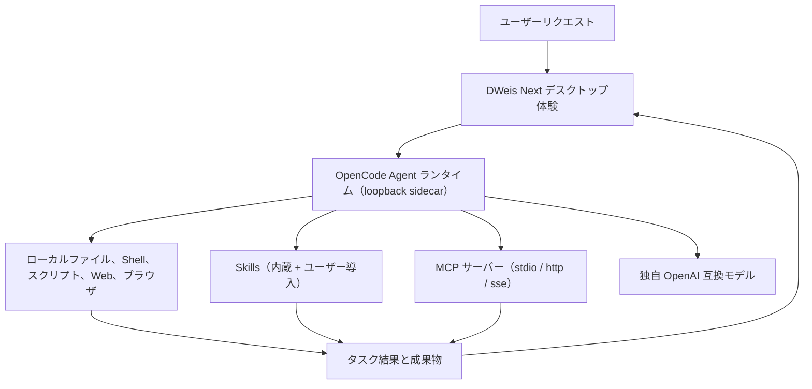

<div align="center">

**English** · [简体中文](README.zh-CN.md) · [日本語](README.ja.md) · [Español](README.es.md) · [한국어](README.ko.md)


# DWeis Next

**OpenCode をベースにした、オープンソースのデスクトップ AI Agent 基盤。**

動くデスクトップ Agent 製品を動かす・フォークする・出荷する——チャット UI のデモではありません。DWeis Next
は、管理された OpenCode Agent ランタイム、ローカルツール、Skills、MCP サーバー、独自モデル、永続
メモリ、洗練されたクロスプラットフォーム Electron 統合をひとつにまとめます。

[ウェブサイト](https://dweis.ai/) · [開発ガイド](docs/development.md) ·
[アーキテクチャ](docs/architecture.md)

[](LICENSE)


</div>

<p align="center">
  
</p>

<p align="center"><em>チャットのリクエストから、再利用可能なインタラクティブな成果物まで、一つのワークスペースで。</em></p>

DWeis Next は [DWeis](https://dweis.ai/) が、Agent ループ周辺の製品インフラを毎回作り直さずに
済むように構築しました。フォークして、モデル・プロンプト・ツール・Skills・ブランド・配布を置き換え、
あなたの製品やワークフロー向けの Agent を出荷できます。

そのまま使うこともできます：ローカルの OpenAI 互換モデルで動かす、またはサインインして DWeis
ホステッドモデル、任意の OpenConnector ランタイム、OAuth 認可、チームワークスペースを利用できます。

## なぜ DWeis Next をオープンソースにしたのか

説得力のある Agent デモは、モデルとチャット入力だけで始められます。しかし日常的に頼られるデスクトップ
Agent には、もっと多くのものが必要です：ランタイムのライフサイクル管理、ストリーミングイベント、
ローカルアクセス制御、モデル資格情報の安全な取り扱い、セッションとプロジェクト、ツール活動、ファイル
成果物、復旧、パッケージ化、そして自律的な仕事を理解可能にする UI。

DWeis Next は完全なデスクトップ基盤を提供することで、あなたが：

- OpenCode をソフトウェア開発以外の Agent ランタイムとして使う
- ドメイン固有のツール、Skills、MCP サーバー、プロンプト、ワークフローを構築する
- ローカル PC 操作と認証済み SaaS アクションを組み合わせる
- 開発者だけが触れるプロトタイプではなく、ブランド付きのデスクトップ製品を配布する
- 自分たちで運用するインフラの量を選ぶ

……ことに集中できるようにします。

## クレジット

DWeis Next は [Wanta](https://github.com/oomol-lab/wanta) のフォークです。Wanta はオリジナルの
デスクトップ Agent プロジェクトです。OpenCode ランタイム統合、Electron アプリケーションアーキテクチャ、
そして製品設計の全体は、そのプロジェクトに由来します。

基盤を築いた Wanta のコントリビューターとチームに感謝します。DWeis Next は引き続き Apache-2.0
ライセンスの下で公開し、変更点をオープンソースコミュニティに還元していきます。

## このリポジトリには何があるか

DWeis Next は今は汎用ワーク Agent ですが、アーキテクチャは派生させることを前提に設計されて
います。オペレーション Agent、リサーチ Agent、サポート Agent、EC Agent、企業ナレッジ Agent、
社内ツール、別のバーティカル製品へと応用できます。

### Agent とランタイム

- **OpenCode ランタイム**を隔離されたローカル sidecar として管理し、loopback HTTP と SSE で駆動
- **ストリーミングチャット**：ツール活動、承認、構造化された質問プロンプト、添付ファイル対応
- **Agent モード**——Build と Plan、日常タスクとコーディングプロジェクト向けの **Work/Code** ペルソナ
- **推論強度**——モデルごとに 低/中/高/超高 から思考レベルを選択
- **ローカル権限**——高リスク操作は実行前に明示的な承認フローを経る

### モデル

- **OpenAI 互換の独自モデル**——任意の provider をモデルと provider ごとに設定
- サインインで **DWeis ホステッドモデル**を利用可能
- **モデル単位の資格情報**を Electron `safeStorage` で暗号化、レンダラには返さない
- `general` と `explore` サブエージェントの **サブエージェントモデル選択**

### ツール・Skills・MCP

- **ローカルツール**——ファイル、Shell、スクリプト、検索、Web、OpenAI 互換 API 経由の画像/動画生成
- **Skills**——インストール/有効/無効状態を持つ管理ディレクトリ、watcher 駆動のリロード、内蔵オフィス
  Skills（PPT/DOCX/XLSX/PDF）
- **MCP サーバー**——stdio / http / sse トランスポート対応の Model Context Protocol サーバーを追加・編集・切替
  （フォーム/生 JSON 両ビュー対応）
- **統合ブラウザ制御**——チャットサイドバーから接続済みウェブサイトにサインインして操作

### 成果物とメモリ

- **成果物パネル**——生成ファイルはタスクに紐づき、画像・PDF・Word・スプレッドシート（インタラクティブな
  Univer ワークブック）・PowerPoint のプレビュー
- **永続メモリ**——Agent スコープのシステムプロンプトとユーザースコープの個人メモリ、両方ともディスク保存、
  設定画面で編集可能、自動レビューに対応

### プロジェクト構造

- **Work と Code のサイドバーセグメント**——日常ワークとコーディングプロジェクトの会話を分けて管理
- **セッション、プロジェクト、アーカイブビュー**——各会話はセッション、各フォルダはプロジェクト
- **Tasks と Automation**——周期的および単発の Agent ジョブ
- **ナレッジベース**——検索可能な個人参考資料ライブラリ

### 設定と利用統計

- **設定ページ**はフルハイトのサイドバー設計——モデル管理、ツール設定、MCP、Skills、メモリ、利用統計、
  更新チャンネル
- **利用統計**——トークン総量、キャッシュヒット率、モデル別内訳

### パッケージと配布

- **クロスプラットフォーム Electron パッケージング**——macOS、Windows、Linux
- **コード署名済みインストーラー**と安定した自動更新チャンネル
- リポジトリ全体は **Apache-2.0 ライセンス**

## ソースから実行

要件：Node.js 22.22.2 以上、Corepack 経由の pnpm。

```bash
git clone https://github.com/3d-jq/DWeis-Next.git
cd DWeis-Next
corepack pnpm install
corepack pnpm run dev
```

これはリポジトリを試す最短ルートです。環境設定、テストコマンド、ランタイム検証、パッケージング、
署名、リリースのワークフローについては [開発ガイド](docs/development.md) を参照してください。

スタックは Electron 42、Vite 8、React 19、Tailwind CSS 4、OpenCode、TypeScript、Vitest、oxlint、
oxfmt。

> ### Agent Engine: OpenCode

DWeis Next はピン留めした `opencode-ai@1.17.13` バイナリをループバック専用の `opencode serve`
サイドカーとして起動し、`@opencode-ai/sdk@1.17.13` で駆動します。OpenCode パッケージは MIT
ライセンスで、[THIRD_PARTY_NOTICES.md](THIRD_PARTY_NOTICES.md) に謝辞を掲載しています。DWeis Next
はランタイム、SDK、プラグインをまったく同じバージョンにピン留めしています（API は安定扱い
されていないため）。

## 自分の Agent を構築する

DWeis Next は OpenCode をピン留めしたローカルランタイムとしてそのまま使用し、OpenCode のソース
フォークは維持しません。デスクトップのメインプロセスが HTTP と SSE で sidecar を制御し、DWeis Next が
Agent 契約、モデル、権限、ツール、Skills、MCP、セッション、製品 UI、デスクトップ統合を提供します。

最も重要な拡張ポイント：

| 領域                                 | まずここを見る                                                       |
| ------------------------------------ | -------------------------------------------------------------------- |
| Agent アイデンティティと実行契約     | [`electron/agent/system-prompt.ts`](electron/agent/system-prompt.ts) |
| Agent モード、モデル、ツール、権限   | [`electron/agent/config.ts`](electron/agent/config.ts)               |
| 独自ツール、Skills、MCP ツールソース | [`electron/agent/tool-sources.ts`](electron/agent/tool-sources.ts)   |
| 内蔵モデルと独自モデルのサポート     | [`electron/models/`](electron/models/)                               |
| チャット、成果物、ブラウザ体験       | [`src/routes/Chat/`](src/routes/Chat/)                               |
| Skills 管理                          | [`src/routes/Skills/`](src/routes/Skills/)                           |
| すべての製品設定                     | [`src/routes/Settings/`](src/routes/Settings/)                       |
| アプリケーションのアイデンティティ   | [`electron/branding.ts`](electron/branding.ts)                       |

Agent の能力は一つの製品契約であり、有効化されたツール、権限ルール、システムプロンプトの三つで
表現されます。実行時の挙動、安全性、UI の期待値を揃えるために三つを一緒に変更してください。
これらの境界を変更する前に [アーキテクチャ](docs/architecture.md) と
[コード規約](docs/conventions.md) を読んでください。

## 仕組み



DWeis Next はモデルコンテキストに provider 固有のツールを大量に登録しません。独自ツール、Skills、
MCP サーバーはそれぞれ小さく明示的な契約であり、認可失敗はモデルの自由テキストではなく構造化された
製品状態として返ります。

### OpenCode・OpenConnector ランタイム・DWeis

- **OpenCode** はローカル Agent ランタイムです。DWeis Next はそのライフサイクルを管理し、Agent
  設定、権限、プロンプト、独自ツール、Skills を提供します。
- **OpenConnector** は任意の Link ランタイムモードです — ユーザー設定のエンドポイント（`baseUrl` +
  `consoleUrl` + 任意の `runtimeToken`）で、利用可能な OpenConnector インスタンスのアクションを
  DWeis Next が消費できるようにします。
- **DWeis** はサインイン、マネージドモデル、Connector 資格情報、OAuth、チーム、Skills、利用状況、
  請求のための任意のホスティング層を提供します。

ローカル BYOK の中核には DWeis アカウントは不要です。サインインはホスティングされた Connector と
チーム層を有効化しますが、デスクトップアプリの閲覧・フォーク・開発には必須ではありません。

プロセス、トラスト境界、IPC、ストリーミング、認証、ストレージ設計の全体は
[アーキテクチャ](docs/architecture.md) を参照してください。

## セキュリティとデータ境界

- OpenCode は loopback のみでリッスンし、プロセスごとにランダムなサーバーパスワードを使用
- DWeis セッショントークンと独自モデル API キーは保存とライフサイクルが分離
- 独自モデルキーは Electron `safeStorage` で暗号化され、レンダラには返らない
- 高リスクなローカル操作は DWeis Next の明示的な承認 UI に接続
- ローカルセッションは DWeis チームワークスペースに黙ってアップロードされない

プライベートな脆弱性報告は [SECURITY.md](SECURITY.md)、完全なトラスト境界は
[アーキテクチャ](docs/architecture.md) を参照してください。

## プロジェクトマップ

| パス                                       | 役割                                                            |
| ------------------------------------------ | --------------------------------------------------------------- |
| [`electron/`](electron/)                   | メインプロセス、preload、Agent ランタイム、デスクトップサービス |
| [`src/`](src/)                             | React レンダラ、ルート、hooks、UI コンポーネント                |
| [`scripts/`](scripts/)                     | 開発、バイナリ準備、パッケージング、配布サポート                |
| [`resources/`](resources/)                 | アプリに同梱されるブランディングとリソース                      |
| [`docs/`](docs/)                           | 製品、アーキテクチャ、開発、規約、意思決定の記録                |
| [`.github/workflows/`](.github/workflows/) | PR とリリースの自動化                                           |

## ドキュメント

- [アーキテクチャ](docs/architecture.md) — プロセス、Agent ランタイム、IPC、ストリーミング、認証、データフロー
- [開発ガイド](docs/development.md) — インストール、実行、テスト、パッケージング、署名、リリース
- [統合ブラウザ](docs/integrated-browser.md) — チャットから接続済みウェブサイトを操作
- [コード規約](docs/conventions.md) — 実装ルールとセキュリティ境界
- [主要な技術的意思決定](docs/key-decisions.md) — アーキテクチャがこうなっている理由
- [プロジェクト概要](docs/project-overview.md) — 製品のスコープとエコシステムの関係
- [コントリビュートガイド](CONTRIBUTING.md) — ブランチ、PR、検証、コントリビュートルール
- [セキュリティポリシー](SECURITY.md) — プライベートな脆弱性報告
- [商標ポリシー](TRADEMARKS.md) と [サードパーティ通知](THIRD_PARTY_NOTICES.md)

## コントリビュート

Issue と Pull Request を歓迎します。大きな挙動や UI の変更を行う前に、まず Issue を開いて製品
の方向とスコープを合意してください。Pull Request を開く前に [CONTRIBUTING.md](CONTRIBUTING.md) を
読んでください。リポジトリのワークフロー、必須検証、コントリビュートが守るべきセキュリティ境界が
書かれています。

コントリビュートを提出することで、あなたが書面で明確に別段の定めをしない限り、Apache License,
Version 2.0 の下で提供されることに同意したものとみなされます。

## ライセンスの範囲

特に記載がない限り、このリポジトリで作成されたソースコード、スクリプト、テスト、ドキュメントは
[Apache License, Version 2.0](LICENSE) の下でライセンスされます。

このライセンスは、第三者製品、サービス、API、商標、商号、ロゴ、アイコン、画面ショット、その他
それぞれの所有者が保有する資料に対する権利を付与しません。第三者の名称と資産は識別と相互運用の
目的でのみ使用されており、その包含はエンドースメント・スポンサーシップ・パートナーシップを意味
するものではありません。
