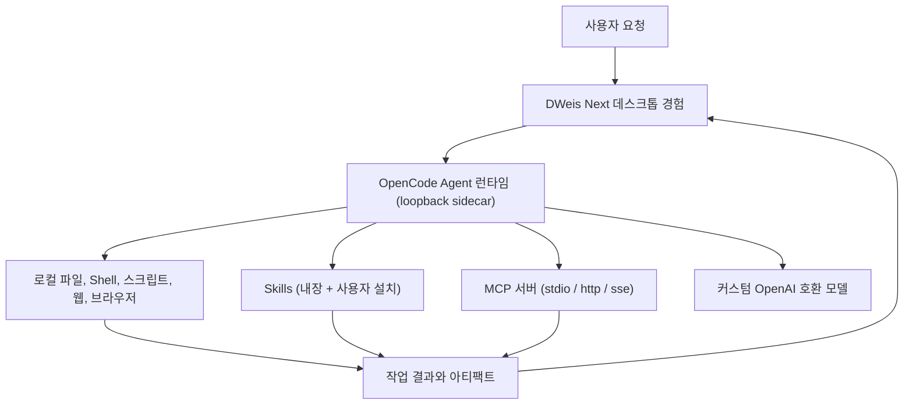

<div align="center">

**English** · [简体中文](README.zh-CN.md) · [日本語](README.ja.md) · [Español](README.es.md) · [한국어](README.ko.md)


# DWeis Next

**OpenCode 기반의 오픈소스 데스크톱 AI Agent 플랫폼.**

동작하는 데스크톱 Agent 제품을 실행하고, 포크하고, 출시하세요 — 채팅 UI 데모가 아닙니다. DWeis Next는
관리되는 OpenCode Agent 런타임, 로컬 도구, Skills, MCP 서버, 커스텀 모델, 영구 메모리, 정제된
크스플랫폼 Electron 인터페이스를 하나로 묶습니다.

[웹사이트](https://dweis.ai/) · [개발 가이드](docs/development.md) ·
[아키텍처](docs/architecture.md)

[](LICENSE)


</div>

<p align="center">
  
</p>

<p align="center"><em>채팅 한 번의 요청에서, 재사용 가능한 인터랙티브 아티팩트까지 — 하나의 워크스페이스에서.</em></p>

DWeis Next는 [DWeis](https://dweis.ai/)이 Agent 루프 주변의 제품 인프라를 매번 새로 만들지 않아도
되도록 만들었습니다. 포크해서 모델, 프롬프트, 도구, Skills, 브랜드, 배포를 교체하고, 여러분의 제품
또는 워크플로우에 맞는 Agent를 출시하세요.

그대로 사용할 수도 있습니다: 로컬에서 OpenAI 호환 모델을 돌리거나, 로그인하여 DWeis 호스티드
모델, 선택적 OpenConnector 런타임, OAuth 인증, 팀 워크스페이스를 이용하세요.

## 왜 DWeis Next를 오픈소스로 공개하나

설득력 있는 Agent 데모는 모델과 채팅 입력만으로 시작할 수 있습니다. 하지만 사람들이 신뢰할 수 있는
데스크톱 Agent에는 더 많은 것이 필요합니다: 런타임 라이프사이클 관리, 스트리밍 이벤트, 로컬 접근
제어, 모델 자격 증명 보안, 세션과 프로젝트, 도구 활동, 파일 아티팩트, 복구, 패키징, 그리고 자율적인
작업을 이해할 수 있게 만드는 UI.

DWeis Next는 완전한 데스크톱 기반을 제공하여 여러분이:

- OpenCode를 소프트웨어 개발을 넘어서는 Agent 런타임으로 사용
- 도메인 특화 도구, Skills, MCP 서버, 프롬프트, 워크플로우 구축
- 로컬 컴퓨터 작업과 인증된 SaaS 액션 결합
- 개발자만 쓸 수 있는 프로토타입이 아닌, 브랜드가 있는 데스크톱 제품 배포
- 직접 운영할 인프라의 양을 자유롭게 선택

…에 집중할 수 있게 합니다.

## 크레딧

DWeis Next는 [Wanta](https://github.com/oomol-lab/wanta)의 포크입니다. Wanta는 최초의 데스크톱
Agent 프로젝트입니다. OpenCode 런타임 통합, Electron 애플리케이션 아키텍처, 그리고 전반적인 제품
설계는 그 프로젝트에서 비롯되었습니다.

이 작업이 서 있는 기반을 만든 Wanta 기여자와 팀에 감사드립니다. DWeis Next는 계속해서 Apache-2.0
라이선스로 배포하며, 변경 사항을 오픈소스 커뮤니티에 공유합니다.

## 이 저장소에는 무엇이 있는가

DWeis Next는 현재 범용 작업 Agent이지만, 아키텍처는 변형을 전제로 설계되었습니다. 운영 Agent,
리서치 Agent, 지원 Agent, 커머스 Agent, 엔터프라이즈 지식 Agent, 내부 도구, 다른 수직 분야의 데스크톱
제품가 될 수 있습니다.

### Agent와 런타임

- **OpenCode 런타임**을 격리된 로컬 sidecar로 관리하고, loopback HTTP와 SSE로 구동
- **스트리밍 채팅**: 도구 활동, 승인, 구조화된 질문 프롬프트, 첨부 파일 지원
- **Agent 모드** — Build와 Plan, 일상 작업과 코딩 프로젝트를 위한 **Work/Code** 페르소나
- **추론 강도** — 모델별로 낮음/보통/높음/최고 사고 단계를 선택
- **로컬 권한** — 고위험 작업은 실행 전에 명시적인 승인 플로우를 거침

### 모델

- **OpenAI 호환 커스텀 모델** — 모든 provider를 모델과 provider 단위로 설정
- 로그인 시 **DWeis 호스티드 모델** 사용 가능
- **모델별 자격 증명**을 Electron `safeStorage`로 암호화, 렌더러에는 절대 반환하지 않음
- `general` 및 `explore` 서브에이전트의 **서브에이전트 모델 선택**

### 도구, Skills, MCP

- **로컬 도구** — 파일, Shell, 스크립트, 검색, 웹, OpenAI 호환 API를 통한 이미지/영상 생성
- **Skills** — 설치/활성화/비활성화 상태를 가진 관리 디렉터리, watcher 기반 리로드, 내장된 오피스
  Skills(PPT/DOCX/XLSX/PDF) 포함
- **MCP 서버** — stdio / http / sse 전송을 지원하는 Model Context Protocol 서버 추가, 편집, 토글
  (폼과 원시 JSON 뷰 지원)
- **통합 브라우저 제어** — 채팅 사이드바에서 연결된 웹사이트에 로그인하여 조작

### 아티팩트와 메모리

- **아티팩트 패널** — 생성된 파일은 작업에 연결되어, 이미지, PDF, Word, 스프레드시트(인터랙티브 Univer
  통합 문서), PowerPoint 미리보기 제공
- **영구 메모리** — Agent 범위 시스템 프롬프트와 사용자 범위 개인 메모리 모두 디스크에 저장되고,
  설정에서 편집 가능하며, 자동 검토 지원

### 프로젝트 구조

- **Work와 Code 사이드바 세그먼트** — 일상 작업과 코딩 프로젝트 세션을 분리하여 관리
- **세션, 프로젝트, 아카이브 뷰** — 각 대화는 세션, 각 폴더는 프로젝트
- **Tasks와 Automation** — 주기적 및 일회성 Agent 작업
- **지식 베이스** — 검색 가능한 개인 참고 자료 라이브러리

### 설정과 사용 통계

- **설정 페이지**는 풀 높이 사이드바 디자인 — 모델 관리, 도구 설정, MCP, Skills, 메모리, 사용 통계, 업데이트 채널
- **사용 통계** — 토큰 총량, 캐시 적중률, 모델별 내역

### 패키징과 배포

- **크로스 플랫폼 Electron 패키징** — macOS, Windows, Linux
- **코드 서명된 인스톨러**와 안정적인 자동 업데이트 채널
- 저장소 전체는 **Apache-2.0 라이선스**

## 소스에서 실행하기

요구 사항: Node.js 22.22.2 이상, Corepack을 통한 pnpm.

```bash
git clone https://github.com/3d-jq/DWeis-Next.git
cd DWeis-Next
corepack pnpm install
corepack pnpm run dev
```

이것은 저장소를 체험하는 가장 짧은 경로입니다. 환경 설정, 테스트 명령, 런타임 검증, 패키징, 서명,
릴리스 워크플로우는 [개발 가이드](docs/development.md)에 있습니다.

스택은 Electron 42, Vite 8, React 19, Tailwind CSS 4, OpenCode, TypeScript, Vitest, oxlint, oxfmt입니다.
DWeis Next는 OpenCode 런타임, SDK, 플러그인을 완전히 동일한 버전으로 핀 고정합니다 (API가 안정
API로 간주되지 않기 때문).

## 자신만의 Agent 만들기

DWeis Next는 OpenCode를 핀 고정된 로컬 런타임으로 직접 사용하며, OpenCode 소스 포크를 유지하지 않습니다.
데스크톱 메인 프로세스가 HTTP와 SSE로 sidecar를 제어하고, DWeis Next가 Agent 계약, 모델, 권한, 도구,
Skills, MCP, 세션, 제품 UI, 데스크톱 통합을 제공합니다.

가장 중요한 확장 포인트:

| 영역                                       | 시작점                                                              |
| ------------------------------------------ | ------------------------------------------------------------------- |
| Agent 정체성과 실행 계약                   | [`electron/agent/system-prompt.ts`](electron/agent/system-prompt.ts) |
| Agent 모드, 모델, 도구, 권한               | [`electron/agent/config.ts`](electron/agent/config.ts)               |
| 커스텀 도구, Skills, MCP 도구 소스         | [`electron/agent/tool-sources.ts`](electron/agent/tool-sources.ts)   |
| 내장 및 커스텀 모델 지원                   | [`electron/models/`](electron/models/)                               |
| 채팅, 아티팩트, 브라우저 경험                | [`src/routes/Chat/`](src/routes/Chat/)                               |
| Skills 관리                                | [`src/routes/Skills/`](src/routes/Skills/)                           |
| 모든 제품 설정                             | [`src/routes/Settings/`](src/routes/Settings/)                       |
| 애플리케이션 정체성                          | [`electron/branding.ts`](electron/branding.ts)                       |

Agent 능력은 하나의 제품 계약이며, 활성화된 도구, 권한 규칙, 시스템 프롬프트 세 곳으로 표현됩니다.
런타임 동작, 안전성, UI 기대치를 일치시키기 위해 세 곳을 함께 변경하세요. 이 경계를 변경하기 전에
[아키텍처](docs/architecture.md)와 [코드 컨벤션](docs/conventions.md)을 읽으세요.

## 동작 방식



DWeis Next는 모델 컨텍스트에 provider별 도구를 대량으로 등록하지 않습니다. 커스텀 도구, Skills, MCP
서버는 각각 작고 명시적인 계약이며, 인증 실패는 모델의 자유 텍스트가 아니라 구조화된 제품 상태로
반환됩니다.

### OpenCode, OpenConnector 런타임, DWeis

- **OpenCode**는 로컬 Agent 런타임입니다. DWeis Next는 그 라이프사이클을 관리하고 Agent 설정, 권한,
  프롬프트, 커스텀 도구, Skills를 제공합니다.
- **OpenConnector**는 선택적 Link 런타임 모드입니다 — 사용자 설정 엔드포인트(`baseUrl` + `consoleUrl` +
  선택적 `runtimeToken`)로, 사용 가능한 OpenConnector 인스턴스의 액션을 DWeis Next가 소비할 수 있게
  합니다.
- **DWeis**은 로그인, 관리형 모델, Connector 자격 증명, OAuth, 팀, Skills, 사용량, 과금을 위한
  선택적 호스팅 계층을 제공합니다.

로컬 BYOK 코어는 DWeis 계정이 필요하지 않습니다. 로그인은 호스팅된 Connector와 팀 계층을 활성화하지만,
데스크톱 앱을 살펴보거나, 포크하거나, 개발하는 데는 필수가 아닙니다.

전체 프로세스, 신뢰 경계, IPC, 스트리밍, 인증, 스토리지 설계는 [아키텍처](docs/architecture.md)를
참고하세요.

## 보안과 데이터 경계

- OpenCode는 loopback에서만 수신 대기하며, 프로세스마다 무작위 서버 비밀번호를 사용
- DWeis 세션 토큰과 커스텀 모델 API 키는 별도의 저장과 라이프사이클을 가짐
- 커스텀 모델 키는 Electron `safeStorage`로 암호화되어 렌더러로 절대 반환되지 않음
- 고위험 로컬 작업은 DWeis Next의 명시적 승인 UI에 연결됨
- 로컬 세션은 DWeis 팀 워크스페이스에 조용히 업로드되지 않음

개인 취약성 보고는 [SECURITY.md](SECURITY.md), 완전한 신뢰 경계는
[아키텍처](docs/architecture.md)를 참고하세요.

## 프로젝트 맵

| 경로                                       | 목적                                                                |
| ------------------------------------------ | ------------------------------------------------------------------- |
| [`electron/`](electron/)                   | 메인 프로세스, preload, Agent 런타임, 데스크톱 서비스                |
| [`src/`](src/)                             | React 렌더러, 라우트, hooks, UI 컴포넌트                            |
| [`scripts/`](scripts/)                     | 개발, 바이너리 준비, 패키징, 배포 지원                              |
| [`resources/`](resources/)                 | 앱과 함께 번들되는 브랜딩과 리소스                                   |
| [`docs/`](docs/)                           | 제품, 아키텍처, 개발, 컨벤션, 의사결정 기록                          |
| [`.github/workflows/`](.github/workflows/) | PR 및 릴리스 자동화                                                 |

## 문서

- [아키텍처](docs/architecture.md) — 프로세스, Agent 런타임, IPC, 스트리밍, 인증, 데이터 흐름
- [개발 가이드](docs/development.md) — 설치, 실행, 테스트, 패키징, 서명, 릴리스
- [통합 브라우저](docs/integrated-browser.md) — 채팅에서 연결된 웹사이트 제어
- [코드 컨벤션](docs/conventions.md) — 구현 규칙과 보안 경계
- [주요 기술 결정](docs/key-decisions.md) — 아키텍처가 이렇게 된 이유
- [프로젝트 개요](docs/project-overview.md) — 제품 범위와 에코시스템 관계
- [기여 가이드](CONTRIBUTING.md) — 브랜치, PR, 검증, 기여 규칙
- [보안 정책](SECURITY.md) — 개인 취약성 보고
- [상표 정책](TRADEMARKS.md) 및 [타사 고지](THIRD_PARTY_NOTICES.md)

## 기여

이슈와 풀 리퀘스트를 환영합니다. 큰 동작 또는 UI 변경을 하기 전에 먼저 이슈를 열어 제품 방향과
범위를 합의하세요. 풀 리퀘스트를 열기 전에 [CONTRIBUTING.md](CONTRIBUTING.md)를 읽으세요. 저장소
워크플로우, 필수 검증, 기여가 지켜야 할 보안 경계가 포함되어 있습니다.

기여를 제출하면, 서면으로 명확히 다르게 명시하지 않는 한 Apache License, Version 2.0 하에 제공됨에
동의한 것으로 간주됩니다.

## 라이선스 범위

별도로 명시되지 않는 한, 이 저장소에서 작성된 소스 코드, 스크립트, 테스트, 문서는
[Apache License, Version 2.0](LICENSE) 하에 라이선스됩니다.

이 라이선스는 제3자 제품, 서비스, API, 상표, 상호, 로고, 아이콘, 스크린샷 또는 각 소유자가 보유한
기타 자료에 대한 권리를 부여하지 않습니다. 제3자 이름과 자산은 식별과 상호 운용 목적일 뿐이며,
그 포함이 보증, 후원, 파트너십을 의미하지는 않습니다.
