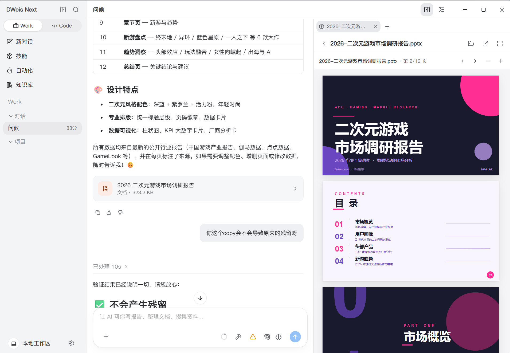
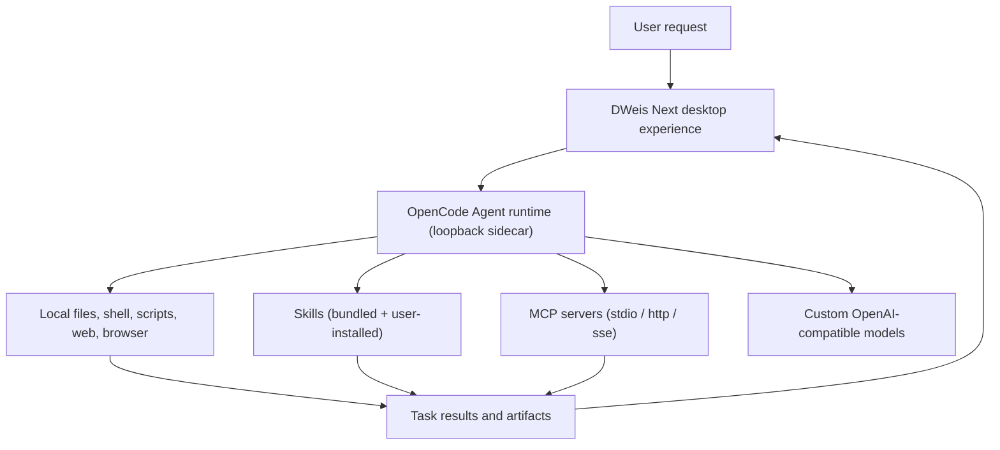

<div align="center">

**English** · [简体中文](README.zh-CN.md) · [日本語](README.ja.md) · [Español](README.es.md) · [한국어](README.ko.md)


# DWeis Next

**An open-source desktop AI agent foundation built on OpenCode.**

Run, fork, and ship a working desktop Agent product — not a chat UI demo. DWeis Next combines a managed
OpenCode Agent runtime, local tools, skills, MCP servers, custom models, persistent memory, and a
polished cross-platform Electron interface.

[Website](https://dweis.ai/) · [Development Guide](docs/development.md) ·
[Architecture](docs/architecture.md)

[](LICENSE)


</div>

<p align="center">
  
</p>

<p align="center"><em>From a chat request to a reusable, interactive artifact in one workspace.</em></p>

DWeis Next is built by [DWeis](https://dweis.ai/) for developers who want to ship useful desktop Agents
without rebuilding the product infrastructure around the Agent loop. Fork it, replace the model,
prompt, tools, skills, branding, and distribution — then ship an Agent for your own product or workflow.

You can use DWeis Next as it is: it runs fully local and self-managed with your own OpenAI-compatible
model — no cloud account, no login, no hosted backend.

## Why We Open-Sourced DWeis Next

A convincing Agent demo can begin with a model and a chat input. A desktop Agent people can rely on
needs much more: runtime lifecycle management, streaming events, local access controls, secure model
credentials, sessions and projects, tool activity, file artifacts, recovery, packaging, and a UI that
makes autonomous work understandable.

DWeis Next opens up the complete desktop foundation so you can:

- use OpenCode as the runtime for Agents beyond software development;
- build domain-specific tools, Skills, MCP servers, prompts, and workflows;
- combine local computer work with web browsing, search, and OpenAI-compatible generation tools;
- distribute a branded desktop product instead of a developer-only prototype;
- choose how much infrastructure to operate yourself.

## Credits

DWeis Next is a fork of [Wanta](https://github.com/oomol-lab/wanta), the original desktop Agent
project. The OpenCode runtime integration, Electron application architecture, and overall product
design originate from that project.

We are grateful to the Wanta contributors and the team that built the foundation this work stands
on. DWeis Next continues to ship under the Apache-2.0 license and shares its changes back with the
open-source community.

## What's in the Repository

DWeis Next is a general work Agent today, but the architecture is designed to be adapted. The open-source
core covers the full desktop product surface and runs entirely on the user's machine.

### Agent and Runtime

- **OpenCode runtime** managed as an isolated local sidecar, driven over loopback HTTP and SSE
- **Streaming chat** with tool activity, approvals, structured question prompts, and attachments
- **Agent modes** — Build and Plan, plus Work/Code personas for everyday tasks vs coding projects
- **Reasoning levels** — per-model selection of low / medium / high / max thinking effort
- **Local permissions** — high-risk actions go through an explicit approval flow before execution

### Models

- **OpenAI-compatible custom models** — any provider, configured per model and per provider
- **Per-model credentials** encrypted with Electron `safeStorage`; never returned to the renderer
- **Subagent model selection** for `general` and `explore` subagents

### Tools, Skills, and MCP

- **Local tools** — files, shell, scripts, search, web, and image/video generation via OpenAI-compatible APIs
- **Skills** — a managed Skills directory with installed/enabled/disabled states, watcher-driven reload,
  and bundled productivity skills (PPT, DOCX, XLSX, PDF) included
- **MCP servers** — add, edit, and toggle Model Context Protocol servers (stdio / http / sse transports)
  with a dedicated form or raw JSON view
- **Integrated browser control** — sign in and operate connected websites from the chat sidebar

### Artifacts and Memory

- **Artifacts panel** — generated files stay attached to the task with previews for images, PDFs, Word
  documents, spreadsheets (interactive Univer workbooks), and PowerPoint decks
- **Persistent memory** — an agent-scoped system prompt and a user-scoped personal memory, both written
  to disk, both editable in Settings, with optional auto-review

### Project Structure

- **Work and Code sidebar segments** — separate session lists for everyday work and coding projects
- **Sessions, projects, and archived view** — every conversation is a session, every folder a project
- **Tasks and Automation** — recurring and one-shot agent jobs
- **Knowledge base** — searchable personal reference library

### Settings and Usage

- **Settings page** with a full-height sidebar — model management, tool configuration, MCP, skills,
  memory, usage stats, and update channel
- **Usage statistics** — token totals, cache hit rate, and per-model breakdown

### Packaging and Distribution

- **Cross-platform Electron packaging** for macOS, Windows, and Linux
- **Code-signed installers** with a stable auto-update channel
- **Apache-2.0 license** for the entire repository

## Run from Source

Requirements: Node.js 22.22.2 or newer and pnpm through Corepack.

```bash
git clone https://github.com/3d-jq/DWeis-Next.git
cd DWeis-Next
corepack pnpm install
corepack pnpm run dev
```

That is the short path for trying the repository. Environment configuration, test commands, runtime
verification, packaging, signing, and release workflows live in the
[Development Guide](docs/development.md).

The stack is Electron 42, Vite 8, React 19, Tailwind CSS 4, OpenCode, TypeScript, Vitest, oxlint, and
oxfmt.

> ### Agent Engine: OpenCode

DWeis Next starts the pinned `opencode-ai@1.17.13` binary as a loopback-only `opencode serve` sidecar
and drives it through `@opencode-ai/sdk@1.17.13`. The OpenCode packages are MIT-licensed and
acknowledged in [THIRD_PARTY_NOTICES.md](THIRD_PARTY_NOTICES.md). DWeis Next pins the runtime, SDK, and
plugins to the same exact version because their APIs are not treated as stable.

## Build Your Own Agent

DWeis Next uses OpenCode as a pinned local runtime and customizes it without maintaining an OpenCode
source fork. The desktop main process controls the sidecar over HTTP and SSE; DWeis Next supplies the
Agent contract, models, permissions, tools, skills, MCP, sessions, product UI, and desktop
integration.

The most important extension points are:

| Area                                        | Start here                                                           |
| ------------------------------------------- | -------------------------------------------------------------------- |
| Agent identity and operating contract       | [`electron/agent/system-prompt.ts`](electron/agent/system-prompt.ts) |
| Agent modes, models, tools, and permissions | [`electron/agent/config.ts`](electron/agent/config.ts)               |
| Custom tools, skills, and MCP tool sources  | [`electron/agent/tool-sources.ts`](electron/agent/tool-sources.ts)   |
| Built-in and custom model support           | [`electron/models/`](electron/models/)                               |
| Chat, artifacts, and browser experience     | [`src/routes/Chat/`](src/routes/Chat/)                               |
| Skills management                           | [`src/routes/Skills/`](src/routes/Skills/)                           |
| All product settings                        | [`src/routes/Settings/`](src/routes/Settings/)                       |
| Application identity                        | [`electron/branding.ts`](electron/branding.ts)                       |

Agent capability is one product contract expressed in three places: enabled tools, permission rules,
and the system prompt. Change them together so runtime behavior, safety, and UI expectations stay
aligned. Read the [Architecture guide](docs/architecture.md) and
[code conventions](docs/conventions.md) before changing these boundaries.

## How It Works



DWeis Next avoids registering hundreds of provider-specific tools in the model context. Custom tools,
Skills, and MCP servers are each a small, explicit contract — authorization failures return as
structured product states instead of free-form model text.

### OpenCode and DWeis

- **OpenCode** is the local Agent runtime. DWeis Next manages its lifecycle and supplies the Agent
  configuration, permissions, prompts, custom tools, and skills.
- **DWeis Next runs local self-managed only**: no hosted accounts, managed models, Connectors,
  teams, or billing. Every model, tool, and credential is configured on the user's own machine.

For the complete process, trust-boundary, IPC, streaming, and storage design, read the
[Architecture guide](docs/architecture.md).

## Security and Data Boundaries

- OpenCode listens only on loopback and uses a random per-process server password.
- Custom model API keys are encrypted with Electron `safeStorage` and are never returned to the renderer.
- High-risk local operations are connected to DWeis Next's explicit approval UI.
- Nothing leaves the machine unless the user's own tools (web search, generation APIs, MCP servers)
  send it.

See [SECURITY.md](SECURITY.md) for private vulnerability reporting and the
[Architecture guide](docs/architecture.md) for complete trust boundaries.

## Project Map

| Path                                       | Purpose                                                               |
| ------------------------------------------ | --------------------------------------------------------------------- |
| [`electron/`](electron/)                   | Main process, preload, Agent runtime, and desktop services            |
| [`src/`](src/)                             | React renderer, routes, hooks, and UI components                      |
| [`scripts/`](scripts/)                     | Development, binary preparation, packaging, and release support       |
| [`resources/`](resources/)                 | Branding and resources bundled with the application                   |
| [`docs/`](docs/)                           | Product, architecture, development, conventions, and decision records |
| [`.github/workflows/`](.github/workflows/) | Pull request and release automation                                   |

## Documentation

- [Architecture](docs/architecture.md) — processes, Agent runtime, IPC, streaming, auth, and data flow
- [Development guide](docs/development.md) — install, run, test, package, sign, and release
- [Integrated browser](docs/integrated-browser.md) — connected website control from chat
- [Code conventions](docs/conventions.md) — implementation rules and security boundaries
- [Key technical decisions](docs/key-decisions.md) — why the architecture is shaped this way
- [Project overview](docs/project-overview.md) — product scope and ecosystem relationships
- [Contributing guide](CONTRIBUTING.md) — branches, pull requests, verification, and contribution rules
- [Security policy](SECURITY.md) — private vulnerability reporting
- [Trademark policy](TRADEMARKS.md) and [third-party notices](THIRD_PARTY_NOTICES.md)

## Contributing

Issues and pull requests are welcome. Before making a substantial behavior or UI change, open an issue
so the product direction and scope can be agreed first. Read [CONTRIBUTING.md](CONTRIBUTING.md) before
opening a pull request; it contains the repository workflow, required verification, and the security
boundaries that contributions must preserve.

By submitting a contribution, you agree that it is provided under the Apache License, Version 2.0,
unless you clearly state otherwise in writing.

## License Scope

Unless otherwise noted, source code, scripts, tests, and documentation authored for this repository
are licensed under the [Apache License, Version 2.0](LICENSE).

This license does not grant rights to third-party products, services, APIs, trademarks, trade names,
logos, icons, screenshots, or other materials owned by their respective holders. Third-party names and
assets are used only for identification and interoperability; their inclusion does not imply
endorsement, sponsorship, or partnership.
