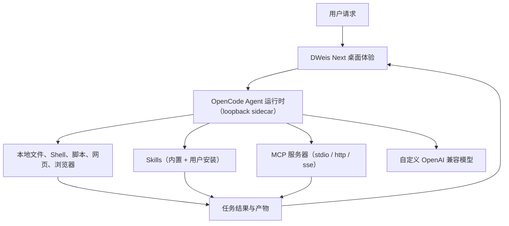

<div align="center">

**English** · [简体中文](README.zh-CN.md) · [日本語](README.ja.md) · [Español](README.es.md) · [한국어](README.ko.md)


# DWeis Next

**基于 OpenCode 的开源桌面 AI Agent 平台。**

运行、Fork、发布一个真正可用的桌面 Agent 产品——而不是一个聊天 UI Demo。DWeis Next 把托管的
OpenCode Agent 运行时、本地工具、Skills、MCP 服务器、自定义模型、持久记忆和精致的跨平台 Electron
界面整合在一起。

[官网](https://dweis.ai/) · [开发指南](docs/development.md) ·
[架构说明](docs/architecture.md)

[](LICENSE)


</div>

<p align="center">
  
</p>

<p align="center"><em>从一次对话请求，到一个可复用的交互式产物，全部在一个工作区完成。</em></p>

DWeis Next 由 [DWeis](https://dweis.ai/) 出品，面向不想围绕 Agent 循环重复搭建产品基础设施的开发者。
Fork 它，换上你自己的模型、提示词、工具、Skills、品牌和分发渠道，就能发布面向你产品或工作流的 Agent。

也可以直接用：本地跑自己的 OpenAI 兼容模型，或者登录使用 DWeis 托管的模型、可选的 OpenConnector
运行时、OAuth 授权和团队工作区。

## 为什么开源 DWeis Next

一个有说服力的 Agent Demo 可能只需要一个模型加一个聊天输入。但一个能让人信赖的桌面 Agent
需要的不止这些：运行时生命周期管理、流式事件、本地访问控制、模型凭据安全、会话与项目、
工具活动、文件产物、恢复机制、打包，以及让自主工作变得可理解的 UI。

DWeis Next 开源了完整的桌面基础，让你可以：

- 把 OpenCode 用作超越软件开发的 Agent 运行时
- 构建领域专用的工具、Skills、提示词和工作流
- 把本地电脑操作与已认证的 SaaS 动作结合
- 发布带品牌的桌面产品，而不是只有开发者能用的原型
- 自由选择自运营或托管的基础设施

## 致谢

DWeis Next 是 [Wanta](https://github.com/oomol-lab/wanta) 的 fork 项目——Wanta 是最初的桌面 Agent
项目。OpenCode 运行时集成、Electron 应用架构与整体产品设计都源自该项目。

感谢 Wanta 的贡献者们搭建了这一切所依赖的基础。DWeis Next 继续以 Apache-2.0 许可证发布，并把
改动回馈给开源社区。

## 仓库里有什么

DWeis Next 现在是一个通用工作 Agent，但架构设计上允许改造。它既可以作为运营 Agent、研究 Agent、
客服 Agent、电商 Agent、企业知识 Agent、办公工具，也能成为另一个垂直桌面产品。

### Agent 与运行时

- **OpenCode 运行时**作为隔离的本地 sidecar，通过 loopback HTTP 和 SSE 驱动
- **流式聊天**，含工具活动、审批、结构化问题提示与附件
- **Agent 模式**——Build 与 Plan，外加 Work/Code 两种工作模式（日常任务 vs 编码项目）
- **推理强度**——每个模型可独立选择 低/中/高/超高 思考档位
- **本地权限**——高危操作执行前走明确的审批流程

### 模型

- **OpenAI 兼容的自定义模型**——任意 provider，按模型与 provider 配置
- **登录后可用 DWeis 托管模型**
- **每模型凭据**用 Electron `safeStorage` 加密，永不返回渲染层
- **子代理模型选择**——`general` 与 `explore` 子代理可独立指定

### 工具、Skills 与 MCP

- **本地工具**——文件、Shell、脚本、搜索、网页，以及通过 OpenAI 兼容 API 的图片/视频生成
- **Skills**——托管的 Skills 目录，含安装/启用/禁用状态，watcher 驱动重载，内置办公 Skills（PPT/DOCX/XLSX/PDF）
- **MCP 服务器**——增删改 Model Context Protocol 服务（stdio / http / sse 传输），支持表单与原始 JSON 两种视图
- **集成浏览器控制**——从聊天侧栏登录并操作已连接的网站

### 产物与记忆

- **产物面板**——生成的文件始终挂在任务上，可预览图片、PDF、Word、交互式电子表格（Univer）和 PPT
- **持久记忆**——Agent 范围的系统提示词和用户范围的个人记忆，都落盘、可在设置中编辑，并支持自动审查

### 项目结构

- **Work 与 Code 侧栏分段**——分别管理日常工作会话与编码项目会话
- **会话、项目与归档视图**——每次对话是一个会话，每个文件夹是一个项目
- **Tasks 与 Automation**——周期性与一次性 Agent 任务
- **知识库**——可搜索的个人参考资料库

### 设置与用量

- **设置页**采用全高侧栏——模型管理、工具配置、MCP、Skills、记忆、用量统计与更新渠道
- **用量统计**——Token 总量、缓存命中率、按模型分布

### 打包与分发

- **跨平台 Electron 打包**——macOS、Windows、Linux
- **代码签名安装包**与稳定的自动更新通道
- 整个仓库采用 **Apache-2.0 许可证**

## 从源码运行

要求：Node.js 22.22.2+ 与通过 Corepack 管理的 pnpm。

```bash
git clone https://github.com/3d-jq/DWeis-Next.git
cd DWeis-Next
corepack pnpm install
corepack pnpm run dev
```

这是体验仓库的最短路径。环境配置、测试命令、运行时验证、打包、签名与发布流程详见
[开发指南](docs/development.md)。

技术栈：Electron 42、Vite 8、React 19、Tailwind CSS 4、OpenCode、TypeScript、Vitest、oxlint、oxfmt。

> ### Agent Engine: OpenCode

DWeis Next 启动固定版本 `opencode-ai@1.17.13` 二进制作为仅回环的 `opencode serve` sidecar，并通过
`@opencode-ai/sdk@1.17.13` 驱动它。OpenCode 各包为 MIT 许可，已在
[THIRD_PARTY_NOTICES.md](THIRD_PARTY_NOTICES.md) 中致谢。DWeis Next 把运行时、SDK 与插件锁定到
完全相同的版本，因为它们的 API 不被视为稳定接口。

## 构建你自己的 Agent

DWeis Next 把 OpenCode 作为锁定的本地运行时直接使用，不维护 OpenCode 源码 fork。桌面主进程通过
HTTP 与 SSE 控制 sidecar；DWeis Next 提供 Agent 契约、模型、权限、工具、Skills、MCP、会话、产品 UI
与桌面集成。

最重要的扩展点：

| 方向                             | 入口                                                                 |
| -------------------------------- | -------------------------------------------------------------------- |
| Agent 身份与运行契约             | [`electron/agent/system-prompt.ts`](electron/agent/system-prompt.ts) |
| Agent 模式、模型、工具与权限     | [`electron/agent/config.ts`](electron/agent/config.ts)               |
| 自定义工具、Skills 与 MCP 工具源 | [`electron/agent/tool-sources.ts`](electron/agent/tool-sources.ts)   |
| 内置与自定义模型支持             | [`electron/models/`](electron/models/)                               |
| 聊天、产物与浏览器体验           | [`src/routes/Chat/`](src/routes/Chat/)                               |
| Skills 管理                      | [`src/routes/Skills/`](src/routes/Skills/)                           |
| 全部产品设置                     | [`src/routes/Settings/`](src/routes/Settings/)                       |
| 应用身份                         | [`electron/branding.ts`](electron/branding.ts)                       |

Agent 能力是一个产品契约，由三处共同表达：启用的工具、权限规则与系统提示词。改它们时要一起改，让
运行时行为、安全性与 UI 预期保持一致。改动这些边界前请阅读
[架构说明](docs/architecture.md) 与 [代码约定](docs/conventions.md)。

## 工作原理



DWeis Next 避免在模型上下文里注册大量 provider 特定的工具。自定义工具、Skills 与 MCP 服务器各自是
一份小而明确的契约——授权失败会以结构化的产品状态返回，而不是模型自由文本。

### OpenCode、OpenConnector 运行时 与 DWeis

- **OpenCode** 是本地 Agent 运行时。DWeis Next 管理其生命周期，并提供 Agent 配置、权限、提示词、
  自定义工具与 Skills。
- **OpenConnector** 是可选的 Link 运行时模式——用户配置的 endpoint（`baseUrl` + `consoleUrl` + 可选
  `runtimeToken`），让 DWeis Next 在有可用 OpenConnector 实例时消费其 action。
- **DWeis** 提供可选的托管层——登录、托管模型、Connector 凭据、OAuth、团队、Skills、用量与计费。

本地 BYOK 内核不需要 DWeis 账号。登录会启用托管 Connector 与团队层，但查看、Fork 或开发桌面
应用并不需要登录。

完整流程、信任边界、IPC、流式、认证与存储设计请阅读 [架构说明](docs/architecture.md)。

## 安全与数据边界

- OpenCode 仅监听 loopback，并使用每进程随机的服务端密码
- DWeis 会话令牌与自定义模型 API key 拥有独立的存储与生命周期
- 自定义模型 key 用 Electron `safeStorage` 加密，永不返回到渲染层
- 高危本地操作接入 DWeis Next 显式的审批 UI
- 本地会话不会悄悄上传到 DWeis 团队工作区

私有漏洞报告请见 [SECURITY.md](SECURITY.md)，完整信任边界见
[架构说明](docs/architecture.md)。

## 项目地图

| 路径                                       | 作用                                    |
| ------------------------------------------ | --------------------------------------- |
| [`electron/`](electron/)                   | 主进程、preload、Agent 运行时与桌面服务 |
| [`src/`](src/)                             | React 渲染层、路由、hooks 与 UI 组件    |
| [`scripts/`](scripts/)                     | 开发、二进制准备、打包与发布支持        |
| [`resources/`](resources/)                 | 与应用一起打包的品牌与资源              |
| [`docs/`](docs/)                           | 产品、架构、开发、约定与决策记录        |
| [`.github/workflows/`](.github/workflows/) | PR 与发布自动化                         |

## 文档

- [架构说明](docs/architecture.md) — 进程、Agent 运行时、IPC、流式、认证与数据流
- [开发指南](docs/development.md) — 安装、运行、测试、打包、签名与发布
- [集成浏览器](docs/integrated-browser.md) — 在聊天里控制已连接的网站
- [代码约定](docs/conventions.md) — 实现规则与安全边界
- [关键技术决策](docs/key-decisions.md) — 架构为何如此
- [项目概览](docs/project-overview.md) — 产品范围与生态关系
- [贡献指南](CONTRIBUTING.md) — 分支、PR、验证与贡献规则
- [安全策略](SECURITY.md) — 私有漏洞报告
- [商标政策](TRADEMARKS.md) 与 [第三方声明](THIRD_PARTY_NOTICES.md)

## 贡献

欢迎提 Issue 和 Pull Request。在做较大的行为或 UI 改动前，请先开一个 Issue，以便先对齐产品方向与范围。
打开 PR 前请阅读 [CONTRIBUTING.md](CONTRIBUTING.md)，里面包含仓库流程、必需验证以及贡献必须遵守的
安全边界。

提交贡献即表示你同意以 Apache License 2.0 提供它，除非你在书面中明确另行声明。

## 许可证范围

除非另有说明，本仓库内编写的源代码、脚本、测试与文档均以
[Apache License, Version 2.0](LICENSE) 授权。

本许可证不授予第三方产品、服务、API、商标、商号、徽标、图标、截图或各自所有者持有的其他材料的
权利。第三方名称与资产仅用于识别与互操作；它们的出现不暗示背书、赞助或合作关系。
